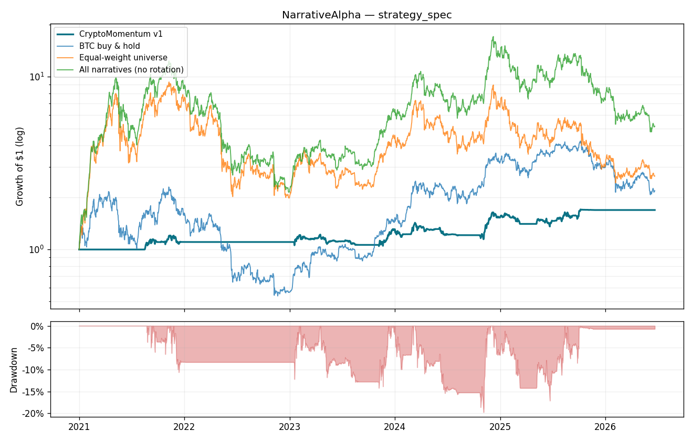

# NarrativeAlpha — Backtest Report

**Strategy:** CryptoMomentum v1 (`strategy_spec.json`)  
**Window:** 2021-01-01 → 2026-06-21 (1998 trading days)  
**Generated:** 2026-06-21 00:12 UTC

> Systematic crypto-desk strategy: long/flat cross-sectional risk-adjusted momentum on the eligible BEP-20 universe, tilted toward tokens in the leading CoinMarketCap narratives, inverse-vol sized with portfolio vol targeting, gated by a BTC 200-DMA trend regime and a max-drawdown halt. Signal at close(d), filled at open(d+1) — no look-ahead. Defaults are fixed (not fit to this data).

## TL;DR

CryptoMomentum v1 returned **+69.34%** (CAGR +10.10%) at a max drawdown of **-19.77%** (Sharpe 0.71, Calmar 0.51), with only +49.05% time in market.

## Equity curve

## Performance metrics

| Metric | Value |
| --- | ---: |
| Total return | +69.34% |
| CAGR | +10.10% |
| Annualized volatility | +16.83% |
| Sharpe | 0.71 |
| Sortino | 0.67 |
| Max drawdown | -19.77% |
| Calmar | 0.51 |
| Exposure (time in market) | +49.05% |
| Hit rate (invested days) | +50.61% |
| Rebalances | 75 |
| Total turnover | 30.64 |
| Total cost | +4.60% |

## Benchmarks

Compared against BTC buy & hold, the passive equal-weight universe, and a no-rotation baseline (holding every narrative basket all the time) — the latter isolates the value added by active selection.

| Strategy / benchmark | Total return | CAGR | Sharpe | Max DD |
| --- | ---: | ---: | ---: | ---: |
| **CryptoMomentum v1** | +69.34% | +10.10% | 0.71 | -19.77% |
| BTC buy & hold | +119.08% | +15.40% | 0.54 | -76.63% |
| Equal-weight universe | +166.55% | +19.61% | 0.63 | -78.76% |
| All narratives (no rotation) | +417.93% | +35.05% | 0.78 | -82.65% |

## Walk-forward validation (in-sample vs out-of-sample)

Split at **2024-04-13** (in-sample: start → split, out-of-sample: split → end).

| Metric | In-sample | Out-of-sample |
| --- | ---: | ---: |
| Total return | +27.29% | +30.77% |
| CAGR | +7.62% | +13.04% |
| Sharpe | 0.57 | 0.90 |
| Sortino | 0.49 | 1.00 |
| Max drawdown | -14.22% | -17.14% |
| Calmar | 0.54 | 0.76 |

## Cost sensitivity

Re-run at multiples of the spec's fee + slippage to confirm the edge survives realistic frictions (1.0× is the spec's own assumption).

| Cost x | Fee bps | Slippage bps | Total return | CAGR | Sharpe | Max DD |
| ---: | ---: | ---: | ---: | ---: | ---: | ---: |
| 0.0 | 0.0 | 0.0 | +77.31% | +11.03% | 0.71 | -19.20% |
| 0.5 | 5.0 | 2.5 | +73.28% | +10.56% | 0.71 | -19.49% |
| 1.0 | 10.0 | 5.0 | +69.34% | +10.10% | 0.71 | -19.77% |
| 2.0 | 20.0 | 10.0 | +61.72% | +9.18% | 0.71 | -20.33% |
| 3.0 | 30.0 | 15.0 | +54.45% | +8.26% | 0.71 | -20.89% |

## Most-held names (top momentum picks)

| Token | Rebalances held | Share of rebalances |
| --- | ---: | ---: |
| ETH | 45 | 32% |
| TRX | 32 | 23% |
| ADA | 30 | 21% |
| LINK | 28 | 20% |
| XRP | 28 | 20% |
| INJ | 25 | 18% |
| AVAX | 23 | 16% |
| DOGE | 22 | 16% |
| FET | 22 | 16% |
| RAY | 20 | 14% |
| BCH | 19 | 13% |
| PENDLE | 18 | 13% |

## Rotation timeline

| Date | State | # held | Holdings |
| --- | --- | ---: | --- |
| … | … | … | _(showing last 40 of 141 rebalances)_ |
| 2024-12-16 | invested | 10 | DOGE, XRP, ADA, SUSHI, BCH, DOT, YFI, ETH, LINK, UNI |
| 2024-12-30 | invested | 10 | XRP, AAVE, ADA, DOGE, LINK, UNI, ETH, SUSHI, COMP, ZEC |
| 2025-01-13 | invested | 10 | XRP, ADA, TRX, DEXE, SUSHI, DOGE, AAVE, LINK, YFI, STG |
| 2025-01-27 | invested | 10 | XRP, DEXE, AAVE, LINK, ADA, RAY, LTC, COMP, LDO, USDC |
| 2025-02-10 | invested | 5 | DEXE, XRP, ACH, RAY, LINK |
| 2025-02-24 | invested | 8 | DEXE, LTC, EURI, CAKE, LDO, XRP, ACH, KAVA |
| 2025-03-10 | RISK-OFF → cash | 0 | CASH |
| 2025-03-24 | RISK-OFF → cash | 0 | CASH |
| 2025-04-07 | RISK-OFF → cash | 0 | CASH |
| 2025-04-21 | RISK-OFF → cash | 0 | CASH |
| 2025-05-05 | invested | 10 | PENGU, RAY, BONK, EURI, FET, FLOKI, XRP, PENDLE, BCH, TRX |
| 2025-05-19 | invested | 10 | FDUSD, PENGU, FLOKI, FET, TRX, BONK, INJ, RAY, ETH, CAKE |
| 2025-06-02 | invested | 10 | AAVE, ETH, PENGU, ZEC, FET, TRX, INJ, PENDLE, RAY, FLOKI |
| 2025-06-16 | invested | 10 | ETH, AAVE, FORM, APE, TRX, INJ, PENGU, ZEC, BCH, FET |
| 2025-06-30 | invested | 10 | BANANAS31, EURI, BCH, ETH, AAVE, FORM, TRX, FDUSD, COMP, UNI |
| 2025-07-14 | invested | 10 | EURI, BCH, TRX, BANANAS31, BONK, AAVE, ETH, PENGU, XRP, UNI |
| 2025-07-28 | invested | 10 | PENGU, ETH, XRP, BONK, UNI, ADA, LINK, TRX, DOGE, LTC |
| 2025-08-11 | invested | 10 | PENGU, ETH, LTC, TRX, FORM, BCH, UNI, XRP, LINK, ADA |
| 2025-08-25 | invested | 10 | HOME, PENGU, LINK, ETH, ADA, FORM, TRX, PENDLE, XRP, LDO |
| 2025-09-08 | invested | 10 | ETH, LINK, HOME, TRX, ADA, AVAX, RAY, USDC, PENGU, AAVE |
| 2025-09-22 | invested | 10 | DOGE, ETH, LINK, AVAX, ZEC, BCH, ADA, HOME, PENDLE, DOT |
| 2025-10-06 | invested | 10 | TWT, AVAX, ZEC, ZRO, SNX, DEXE, TUSD, USD1, DOGE, HUMA |
| 2025-10-20 | invested | 10 | ZEC, SNX, TWT, BAT, CAKE, ETH, STG, TUSD, DOGE, XRP |
| 2025-11-03 | invested | 10 | ZEC, TWT, USD1, USDC, SNX, FDUSD, BAT, TUSD, XUSD, BCH |
| 2025-11-17 | RISK-OFF → cash | 0 | CASH |
| 2025-12-01 | RISK-OFF → cash | 0 | CASH |
| 2025-12-15 | RISK-OFF → cash | 0 | CASH |
| 2025-12-29 | RISK-OFF → cash | 0 | CASH |
| 2026-01-12 | RISK-OFF → cash | 0 | CASH |
| 2026-01-26 | RISK-OFF → cash | 0 | CASH |
| 2026-02-09 | RISK-OFF → cash | 0 | CASH |
| 2026-02-23 | RISK-OFF → cash | 0 | CASH |
| 2026-03-09 | RISK-OFF → cash | 0 | CASH |
| 2026-03-23 | RISK-OFF → cash | 0 | CASH |
| 2026-04-06 | RISK-OFF → cash | 0 | CASH |
| 2026-04-20 | RISK-OFF → cash | 0 | CASH |
| 2026-05-04 | RISK-OFF → cash | 0 | CASH |
| 2026-05-18 | RISK-OFF → cash | 0 | CASH |
| 2026-06-01 | RISK-OFF → cash | 0 | CASH |
| 2026-06-15 | RISK-OFF → cash | 0 | CASH |

---

_Reproduce: `python scripts/report.py strategy_spec.json`. Past performance does not guarantee future results._
